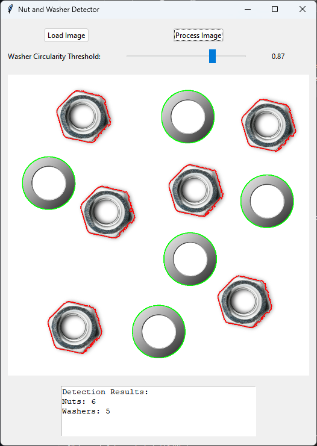

# Nut and Washer Detector

A computer vision application that detects and classifies nuts and washers in images using OpenCV and image processing techniques.



## Features

- Upload images containing nuts and washers
- Detect and classify objects using contour detection and shape analysis
- Adjustable circularity threshold for improved washer detection
- Real-time display of processed images with object highlighting
- Count and display detection results

## Technologies Used

- Python 3.x
- OpenCV (cv2) for image processing and contour detection
- NumPy for numerical computations
- Tkinter for the graphical user interface
- PIL/Pillow for image handling

## Installation

1. Clone this repository:
   ```
   git clone https://github.com/yourusername/nut-washer-detector.git
   cd nut-washer-detector
   ```

2. Install the required dependencies:
   ```
   pip install -r requirements.txt
   ```

## Usage

Run the main application:

```
python main.py
```

1. Click "Load Image" to select an image containing nuts and washers
2. Adjust the circularity threshold slider if needed
3. Click "Process Image" to detect objects
4. View results in the text area at the bottom

## How It Works

The application uses the following image processing pipeline:

1. **Preprocessing**: Converts the image to grayscale and applies Gaussian and median blurring to reduce noise
2. **Thresholding**: Uses adaptive thresholding to convert the image to binary
3. **Contour Detection**: Finds contours in the binary image
4. **Shape Analysis**: 
   - For nuts: Detects hexagonal shapes with inner holes
   - For washers: Identifies circular shapes with high circularity and inner holes
5. **Visualization**: Highlights detected objects with colored contours (green for washers, red for nuts)

## License

This project is licensed under the MIT License - see the [LICENSE](LICENSE) file for details.